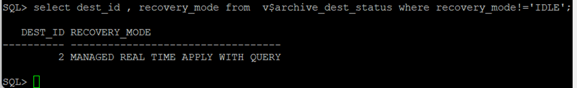
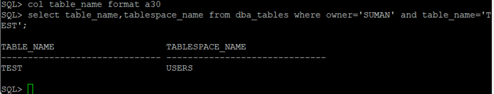
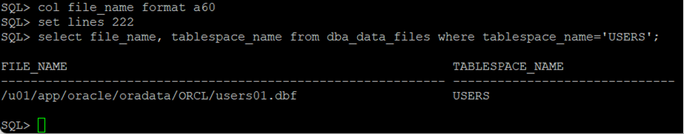
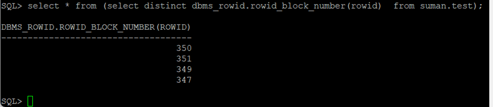

## Automatic Block Media Recovery in a DataGuard

Starting from Oracle 12.2 in Data Guard Configuration the corrupted data blocks are automatically recovered with uncorrupted copies among the instances participating in the configuration. However there are few things:
1. Oracle Active Data Guard Lisence is required as the standby database must be in Real-Time Query Mode.
2. The pysical standby database must be operating MANAGED REAL TIME APPLY with READ ONLY WITH APPLY mode.

Automatic repair is supported with any Data Guard protection mode and works in two directions but one of the instance participating in Data Guard must have healthy block. When an automatic block repair has been performed, a message is written to the database alert log. If automatic block repair is not possible, an ORA-1578 error is returned.

We will be using below configuration to test this scenario:

#### Data Guard Configuration

<table>
<tr><th>Primary </th><th>Standby</th></tr>
<tr><td>

| Parameter      | Value |
| ----------- | ----------- |
| Version      | 19.3       |
| Database Type   | Standalone        |
| ASM | NO |
|Source host | mysqlvm1.localdomain|
|Source database |orcl|
|Source unique name |orcl|

</td><td>

| Parameter      | Value |
| ----------- | ----------- |
| Version      | 19.3       |
| Database Type   | Standalone        |
|ASM | NO|
|Source host | mysqlvm4.localdomain|
|Source database |orcl|
|Source unique name |orcldr|

</td></tr> </table>

<ins>Step 1: Verify the primary (As we are simulating the block corruption, we are just verifying)</ins>
```
SQL> select name, open_mode,database_role from v$database;

NAME      OPEN_MODE            DATABASE_ROLE
--------- -------------------- ----------------
ORCL      READ WRITE           PRIMARY

SQL> select * from v$database_block_corruption;

no rows selected

SQL> col destination format a60
SQL> col dest_name format a20
SQL> select dest_name,DESTINATION,status from v$archive_dest where destination is not null; 
DEST_NAME            DESTINATION                                                  STATUS
-------------------- ------------------------------------------------------------ ---------
LOG_ARCHIVE_DEST_1   /u01/app/oracle/product/19.0.0.0/dbhome_1/dbs/arch           VALID
LOG_ARCHIVE_DEST_2   orcldr                                                       VALID

SQL>
```
***
<ins>Step 2: Verify Log shipping mode in <strong>Primary</strong> </ins>
```
SQL> select dest_id , recovery_mode from  v$archive_dest_status where recovery_mode!='IDLE';

   DEST_ID RECOVERY_MODE
---------- ----------------------------------
         2 MANAGED REAL TIME APPLY WITH QUERY

SQL>
```
***

<ins>Step 3: Lets Verify the Standby database ot see if its in READ ONLY WITH APPLY and in Real TIME APPLY mode </ins>
```
SQL> select name, open_mode, database_role from v$database;

NAME      OPEN_MODE            DATABASE_ROLE
--------- -------------------- ----------------
ORCL      READ ONLY WITH APPLY PHYSICAL STANDBY

SQL> select * from v$database_block_corruption;

no rows selected

SQL> set lines 222
SQL> col destination format a60
SQL> col dest_name format a20
SQL> select dest_name,DESTINATION,status from v$archive_dest where destination is not null;

DEST_NAME            DESTINATION                                                  STATUS
-------------------- ------------------------------------------------------------ ---------
LOG_ARCHIVE_DEST_1   /u01/app/oracle/product/19.0.0.0/dbhome_1/dbs/arch           VALID
STANDBY_ARCHIVE_DEST /u01/app/oracle/product/19.0.0.0/dbhome_1/dbs/arch           VALID

SQL>

SQL> select dest_id , recovery_mode from  v$archive_dest_status where recovery_mode!='IDLE';

   DEST_ID RECOVERY_MODE
---------- ----------------------------------
         1 MANAGED REAL TIME APPLY

SQL>
SQL> col value format a50
SQL> select name, value from v$dataguard_stats;

NAME                             VALUE
-------------------------------- --------------------------------------------------
transport lag                    +00 00:00:00
apply lag                        +00 00:00:00
apply finish time
estimated startup time           7

SQL>
```
***

<ins>Step 4: Lets identify the object and its block for which we want to simulate corruption (We are doing this in <strong>primary</strong>)</ins>
```
SQL> col table_name format a30
SQL> select table_name,tablespace_name from dba_tables where owner='SUMAN' and table_name='TEST';

TABLE_NAME                     TABLESPACE_NAME
------------------------------ ------------------------------
TEST                           USERS

SQL> col file_name format a60
SQL> set lines 222
SQL> select file_name, tablespace_name from dba_data_files where tablespace_name='USERS';

FILE_NAME                                                    TABLESPACE_NAME
------------------------------------------------------------ ------------------------------
/u01/app/oracle/oradata/ORCL/users01.dbf                     USERS

SQL>
SQL> select * from (select distinct dbms_rowid.rowid_block_number(rowid)  from suman.test);

DBMS_ROWID.ROWID_BLOCK_NUMBER(ROWID)
------------------------------------
                                 350
                                 351
                                 349
                                 347

SQL>
```
***

<ins>Step 5: Before simulating lets verify that datafile has no corruption</ins>
```
[oracle@mysqlvm1 ~]$ dbv file=/u01/app/oracle/oradata/ORCL/users01.dbf blocksize=8192

DBVERIFY: Release 19.0.0.0.0 - Production on Sun Dec 17 12:16:59 2023

Copyright (c) 1982, 2019, Oracle and/or its affiliates.  All rights reserved.

DBVERIFY - Verification starting : FILE = /u01/app/oracle/oradata/ORCL/users01.dbf


DBVERIFY - Verification complete

Total Pages Examined         : 640
Total Pages Processed (Data) : 65
Total Pages Failing   (Data) : 0
Total Pages Processed (Index): 15
Total Pages Failing   (Index): 0
Total Pages Processed (Other): 467
Total Pages Processed (Seg)  : 0
Total Pages Failing   (Seg)  : 0
Total Pages Empty            : 93
Total Pages Marked Corrupt   : 0
Total Pages Influx           : 0
Total Pages Encrypted        : 0
Highest block SCN            : 2186796 (0.2186796)
[oracle@mysqlvm1 ~]$

[oracle@mysqlvm1 ~]$ rman target /

Recovery Manager: Release 19.0.0.0.0 - Production on Sun Dec 17 12:18:01 2023
Version 19.3.0.0.0

Copyright (c) 1982, 2019, Oracle and/or its affiliates.  All rights reserved.

connected to target database: ORCL (DBID=1683545872)

RMAN> backup validate check logical datafile 7 SECTION SIZE 1024M;

Starting backup at 17-DEC-23
using target database control file instead of recovery catalog
allocated channel: ORA_DISK_1
channel ORA_DISK_1: SID=85 device type=DISK
channel ORA_DISK_1: starting full datafile backup set
channel ORA_DISK_1: specifying datafile(s) in backup set
input datafile file number=00007 name=/u01/app/oracle/oradata/ORCL/users01.dbf
channel ORA_DISK_1: backup set complete, elapsed time: 00:00:01
List of Datafiles
=================
File Status Marked Corrupt Empty Blocks Blocks Examined High SCN
---- ------ -------------- ------------ --------------- ----------
7    OK     0              93           641             2194605
  File Name: /u01/app/oracle/oradata/ORCL/users01.dbf
  Block Type Blocks Failing Blocks Processed
  ---------- -------------- ----------------
  Data       0              65
  Index      0              15
  Other      0              467

Finished backup at 17-DEC-23

RMAN>
```
***
<ins>Step 2: </ins>




