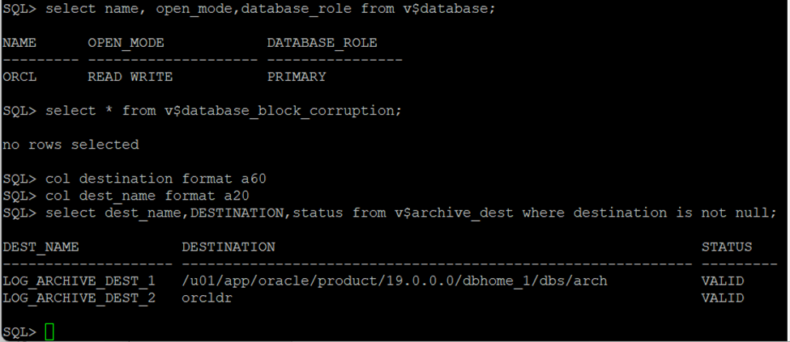

## Automatic Block Media Recovery in a DataGuard

Starting from Oracle 12.2 in Data Guard Configuration the corrupted data blocks are automatically recovered with uncorrupted copies among the instances participating in the configuration. However there are few things:
1. Oracle Active Data Guard Lisence is required as the standby database must be in Real-Time Query Mode.
2. The pysical standby database must be operating MANAGED REAL TIME APPLY with READ ONLY WITH APPLY mode.

Automatic repair is supported with any Data Guard protection mode and works in two directions but one of the instance participating in Data Guard must have healthy block. When an automatic block repair has been performed, a message is written to the database alert log. If automatic block repair is not possible, an ORA-1578 error is returned.

We will be using below configuration to test this scenario:

#### Data Guard Configuration

<table>
<tr><th>Primary </th><th>Standby</th></tr>
<tr><td>

| Parameter      | Value |
| ----------- | ----------- |
| Version      | 19.3       |
| Database Type   | Standalone        |
| ASM | NO |
|Source host | mysqlvm1.localdomain|
|Source database |orcl|
|Source unique name |orcl|

</td><td>

| Parameter      | Value |
| ----------- | ----------- |
| Version      | 19.3       |
| Database Type   | Standalone        |
|ASM | NO|
|Source host | mysqlvm4.localdomain|
|Source database |orcl|
|Source unique name |orcldr|

</td></tr> </table>

Step 1: Verify the primary (As we are simulating the block corruption, we are just verifying)
***

```
SQL> select name, open_mode,database_role from v$database;

NAME      OPEN_MODE            DATABASE_ROLE
--------- -------------------- ----------------
ORCL      READ WRITE           PRIMARY

SQL> select * from v$database_block_corruption;

no rows selected

SQL> col destination format a60
SQL> col dest_name format a20
SQL> select dest_name,DESTINATION,status from v$archive_dest where destination is not null; 
DEST_NAME            DESTINATION                                                  STATUS
-------------------- ------------------------------------------------------------ ---------
LOG_ARCHIVE_DEST_1   /u01/app/oracle/product/19.0.0.0/dbhome_1/dbs/arch           VALID
LOG_ARCHIVE_DEST_2   orcldr                                                       VALID

SQL>
```


